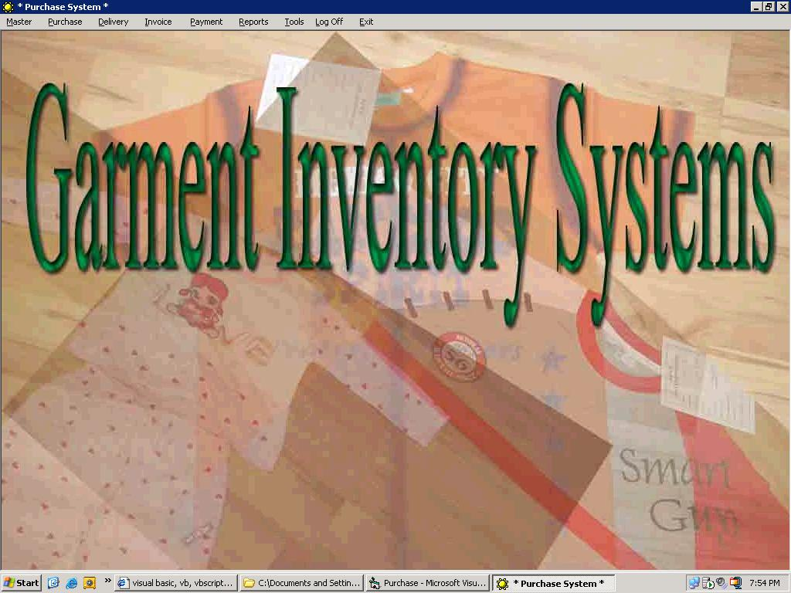



## Garment Inventory System

### Description

Small Textile Export company Can be Used This Codings
 
### More Info
 
Purchase Order , Goods Receipt, Delivery,Invoice

Raise,Payment &amp; Reporting , user Creation

             |
---                |---
**Submitted On**   |2008-08-22 14:12:36
**By**             |[Rasakumar](https://github.com/Planet-Source-Code/PSCIndex/blob/master/ByAuthor/rasakumar.md)
**Level**          |Intermediate
**User Rating**    |4.2 (21 globes from 5 users)
**Compatibility**  |VB 6\.0, VBA MS Access
**Category**       |[Complete Applications](https://github.com/Planet-Source-Code/PSCIndex/blob/master/ByCategory/complete-applications__1-27.md)
**World**          |[Visual Basic](https://github.com/Planet-Source-Code/PSCIndex/blob/master/ByWorld/visual-basic.md)
**Archive File**   |[Garment\_In2124738252008\.zip](https://github.com/Planet-Source-Code/rasakumar-garment-inventory-system__1-71008/archive/master.zip)

